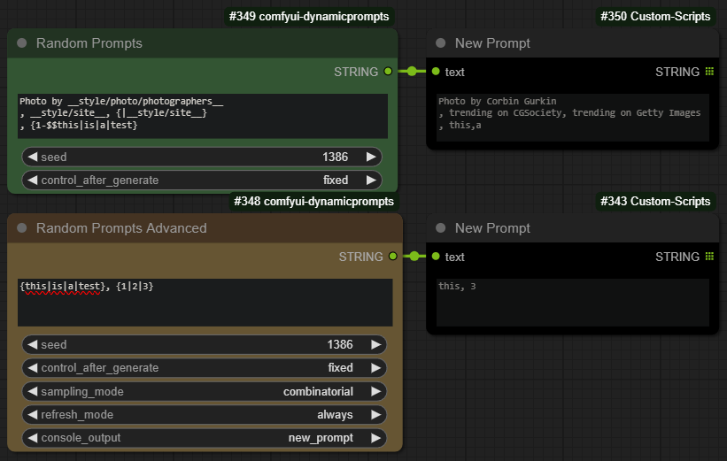

# ComfyUI-DynamicPrompts Custom Nodes *- modified by cbaoth*


ComfyUI-DynamicPrompts is a custom nodes library that integrates into your existing ComfyUI Library. It provides nodes that enable the use of [Dynamic Prompts](https://github.com/adieyal/dynamicprompts) in your ComfyUI. The nodes provided in this library are:

1. [Random Prompts](https://github.com/adieyal/sd-dynamic-prompts/blob/main/docs/SYNTAX.md#variants) - Implements standard wildcard mode for random sampling of variants and wildcards.
2. [Combinatorial Prompts](https://github.com/adieyal/sd-dynamic-prompts/blob/main/docs/SYNTAX.md#combinatorial-sampler) - Iterates through every possible combination of random values in a prompt.
3. [I'm Feeling Lucky](https://github.com/adieyal/dynamicprompts#im-feeling-lucky) - Uses the given prompt to download a related prompt from Lexica.art.
4. [Magic Prompt](https://github.com/adieyal/dynamicprompts#magic-prompt) - Employs a neural network to add relevant modifiers to your prompt.
5. [Jinja2 Templates](https://github.com/adieyal/dynamicprompts#jinja2-templates) - Allows you to write prompts using Jinja2 templates.

Nodes can be found in the Dynamic Prompts menu:


## Useful Links
* [Dynamic Prompts Home](https://github.com/adieyal/dynamicprompts)
* [Dynamic Prompts Syntax](https://github.com/adieyal/sd-dynamic-prompts/blob/main/docs/SYNTAX.md)
* [Dynamic Prompts Extension for Auto1111](https://github.com/adieyal/sd-dynamic-prompts)
* [Tutorial](https://github.com/adieyal/sd-dynamic-prompts/blob/main/docs/tutorial.md)
* [Online Resources](https://github.com/adieyal/sd-dynamic-prompts/blob/main/docs/resources.md)
* [CHANGELOG](./CHANGELOG.md)
* [Stable Diffusion SDXL Wildcards and ComfyUI](https://ericri.medium.com/stable-diffusion-sdxl-wildcards-and-comfyui-e8483e00e1c)

## Installation

### Using ComfyUI-Manager
1. Install [ComfyUI-Manager](https://github.com/ltdrdata/ComfyUI-Manager) if it isn't already.
2. Press Install Custom Nodes from the ComfyUI-Manager menu
3. Search for dynamicprompts
4. Click install

### Manual installation

Follow the steps below to install the ComfyUI-DynamicPrompts Library. These commands assume the your current working directory is the ComfyUI root directory.

1. Clone the repository:
   ```
   git clone https://github.com/adieyal/comfyui-dynamicprompts custom_nodes/comfyui-dynamicprompts
   ```
2. Install the required Python packages:
   ```
   python -m pip install -r custom_nodes/comfyui-dynamicprompts/requirements.txt
   ```
3. Run install.py:
   ```
   python custom_nodes/comfyui-dynamicprompts/install.py
   ```
4. `mkdir custom_nodes/comfyui-dynamicprompts/wildcards`
5. (Optional) download a wildcard collection and copy it into this new wildcards folder.
6. Restart your ComfyUI.
7. Example workflows can be found in `custom_nodes/comfyui-dynamicprompts/example_workflows`.

## Wildcards
The extension looks for wildcard files in `custom_nodes/comfyui-dynamicprompts/wildcards`. It supports wildcard files in `.txt`, .`json` and .`yaml` ([example format](https://github.com/adieyal/sd-dynamic-prompts/blob/main/collections/publicprompts.yaml)).

There are many pre-built wildcards collections available. Here are a few to get you started:
* [SD Dynamic Prompts built-in](https://github.com/adieyal/sd-dynamic-prompts/tree/main/collections)
* [Civitai wildcard packs](https://github.com/adieyal/sd-dynamic-prompts/blob/main/docs/resources.md#wildcard-packs)


## Node Outputs

All nodes in this library produce a String output that can typically be passed into Clip Text Encode Prompts. Both positive and negative nodes are supported.

Please note, since ComfyUI is inherently stateless, some nodes might have a slightly unexpected behavior:

- The Combinatorial Prompt generation iterates through all possible values in a cycle. For example, A `{red|green|blue}` ball will generate the following sequence:
  - A red ball
  - A green ball
  - A blue ball
  - A red ball
  - ...

- The I'm Feeling Lucky, Magic Prompt, and Jinja2 nodes have an optional auto refresh parameter. If set to `True`, a new prompt is generated for every iteration. However, if set to `False`, a prompt will be downloaded once and used for subsequent generations.

## Roadmap

1. This is a quick and dirty release with some known limitations such as non-configurable random seeds, inability to select the MagicPrompt model, and absence of several other configuration features.
2. Currently, the only way to view the generated prompt is through console output. A future release will introduce nodes to display the generate prompt on screen and to write it to a file.
3. It is not currently possible to chain generators, this functionality will be added in future releases.
5. The installation script will be  automated in the future for ease of use.

## Updates 2024-11-13 by cbaoth

* Merged changes done by [do49](https://github.com/do49/comfyui-dynamicprompts)
  * [Disabled sorting of wildcards](https://github.com/adieyal/comfyui-dynamicprompts/commit/dce7210b36b610858b1f38511354b54d5080ba4d)
  * [Made changes to allow a single node to switch between C and R modes](https://github.com/adieyal/comfyui-dynamicprompts/commit/455c851f3762f285e7985b04ef2b79d695b1df96), meaning the two modes:
    * `random` - Generate a single random prompt based on wildcards in the prompt text (default)
    * `combinational` - Generate all possible prompts based on wildcards in the prompt text (see [sd-dynamic-prompts readme](https://github.com/adieyal/sd-dynamic-prompts?tab=readme-ov-file#combinatorial-generation))
      * *Note: Be aware that if a lot of wildcards and/or large wildcard-sets are used, the number of possible prompts can grow exponentially and interrupt is usually not possible at this point. Even though only a single prompt is returned at a time (but more invocation + seed), all possible combinations are (most likely) prepared in memory ahead of time.*
* Added new `DPRandomGeneratorAdvanced` node
  * Renamed `mode` input (see feature above) to `sampling_mode` for clarification and distinction
  * Added new `refresh_mode` input with two options:
    * `always` - Always trigger/re-evaluate the node by resetting the `IS_CHANGED` state (original behavior)
      * This must be enabled in case `combinational` mode is used to generate all possible prompts using the same seed
    * `on_value_change` - Only trigger/re-evaluate the node when any input value (text, seed, etc.) has changes (new default behavior)
      * This is likely the preferred behavior for most use-cases, including `combinational` mode in case the same prompt should be reproduced multiple times
  * Added new `console_output` input with two options:
    * `off` - Do not print the generated prompt to the console (new default behavior)
      * I often times modify the prompts afterwards and use nodes to display the final prompt and save it in the metadata
    * `final_prompt` - Print the generated prompt to the console (original behavior)
    * `debug` - Print the generated prompt and additional information to the console (only IS_CHANGED hash for now)
* Updated the original `DPRandomGenerator` node to use the new `DPRandomGeneratorAdvanced` node with my preferred default settings (fixed values, both inputs are gone to safe space)
  * `sampling_mode` set to `random`
  * `refresh_mode` set to `on_value_change`
  * `console_output` set to `off`


